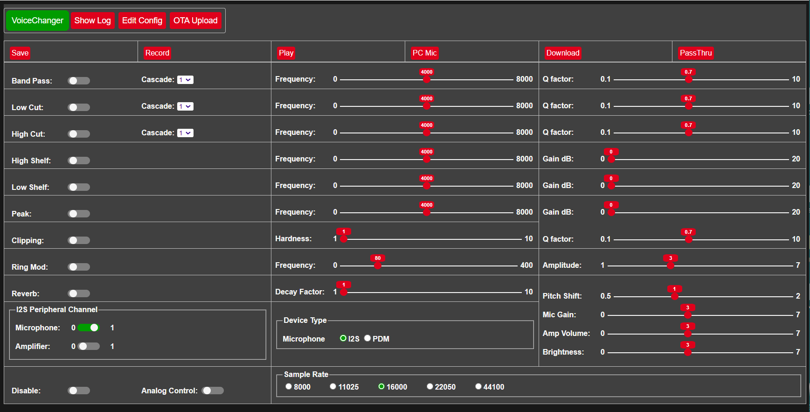

# ESP32-VoiceChanger

ESP32 application to change a voice to be eg stormtrooper or dalek sounding, either in real time for cosplay or as a recording. Recordings can be downloaded to the browser as a WAV file
for playback on a media player.
Can be hosted on a ESP32 or ESP32-S3.

Version 1.4 updated to compile with Arduino core 2.x or 3.x, but if app compiled with arduino core v3.x:
* ESP32 cannot be used yet, only ESP32S3.
* PDM microphone and analog amplifier not yet available.

## Installation

Download github files into the Arduino IDE sketch folder, removing `-main` from the application folder name.
Compile using arduino core v2.x or V3.x with PSRAM enabled and the following Partition scheme:
* ESP32 - `Minimal SPIFFS (...)`
* ESP32S3 - `8M with spiffs (...)`

On first installation, the application will start in wifi AP mode - connect to SSID: **VoiceChanger_...**, to allow router and password details to be entered via the web page on `192.168.4.1`. The configuration data file (except passwords) is automatically created, and the application web pages automatically downloaded from GitHub to the SD card **/data** folder when an internet connection is available.

Subsequent updates to the application, or to the **/data** folder files, can be made using the **OTA Upload** tab. The **/data** folder can also be reloaded from GitHub using the **Reload /data** button on the **Edit Config** tab, or by using a WebDAV client.

## Hardware

A microphone and amplifier with speaker needs to be connected to the ESP32, and / or a [remote microphone](#remote-microphone) can be used.
Optionally LEDs and MY9221 based LED bars can be connected that will flash according to the sound level.
A potentiometer can also be connected to control amplifier volume and LED brightness.
To enable recording the ESP32 needs to host PSRAM.

The types of microphone and amplifier that can be connected are combinations of I2S (mic & amp), PDM (mic) and Analog (amp).
At least one device must be I2S as the ESP32 only supports PDM and Analog on one I2S peripheral. Analog microphones are not supported as low quality.
Cheap I2S devices that have been successfully tested with this app are:
* INMP441 I2S microphone
* MAX98357A I2S 3W amplifier

Other devices tested are:
* MP34DT01 PDM microphone
* ICSK025A DAC 3W amplifier

Analog devices are not supported by I2S on ESP32-S3.

The application can be controlled by hardware buttons connected to pins defined via the app web page.

For realtime voice changing, the microphone must be acoustically shielded from the speaker to prevent feedback squeal.

## Usage

Voice changing is achieved by applying software filters:
* Bandpass: emphasise a particular range of frequencies
* Highcut (lowpass): attentuate higher frequencies 
* Lowcut (highpass): attentuate lower frequencies
* Peak: amplify particular frequencies
* Lowshelf: amplify lower frequencies
* Highshelf: amplify higher frequencies
* Ring modulator: use sinewave to create a dalek style voice 
* Clipping: reduce higher amplitudes depending on clippping hardness factor
* Reverb: add reverberation, depending on decay factor
* Pitch Shift: change pitch up or down without affecting speed. This is resource intensive so wont work in real time, only on recordings.

Biquad filters can also be cascaded to accentuate a particular effect. For more detail on biquad filters see eg. https://arachnoid.com/BiQuadDesigner/index.html

## Web page controller

Control buttons:
* Save: save current configuration to storage
* Record / Stop Record: save microphone input to PSRAM (up to 60 secs (ESP32) / 180 secs (ESP32S3) at 16kHz) without filtering, but with Preamp Gain applied
* Play / Stop Play: play recording currently in PSRAM using current filter settings
* PC Mic / Stop PC Mic: use browser [microphone](#remote-microphone)
* Download: download to browser the current recording using the current filtering as a file named `VoiceChanger.wav` 
* PassThru / Stop PassThru: microphone input filtered and output to speaker directly

As the recorded data is not filtered it can be replayed with different filter configurations to find the best filter combination and settings.

Other settings:
* Preamp Gain: microphone gain
* Volume: amplifier volume level
* Brightness: Maximum LED brightness level
* Analog Control: if on, volume and brightness are controlled by potentiometer instead of web page
* Disable: if on, disables current filter settings without changing them to hear original

Example configuration for radio style voice:  
* Low Cut: Frequency 1500, Cascade 2
* High Cut: Frequency 2000, Q Factor 0.7
* Low Shelf: Frequency 2500, Gain dB 6 
* Peak: Frequency 400, Q Factor 0.7, Gain dB 3  

Example configuration for dalek style voice:  
* Low Cut: Frequency 100, Q Factor 0.7
* High Cut: Frequency 2000, Q Factor 0.7
* Ring Mod: Frequency 50

## Configuration Tabs

* **Show Log**: Opens web socket to view log messages dynamically.

* **OTA Update**: Update application bin file or files in **/data** folder using OTA.

* **Edit Config**:

  * **Reboot & Save**: Save configuration changes and restart the ESP to apply.

  * **Clear NVS**: Clear current passwords.

  * **Reload /data**: Reload data files from github.

  * **Wifi**: WiFi and webserver settings.

  * **Pins**: Define pins used by microphone, amplifier, buttons.

## Remote Microphone

If a PC or phone has a built in microphone this can accessed from the browser and streamed to the ESP32. Due to Windows and browser security constraints this requires some steps to enable it to be used, see notes in file `audio.cpp` 

Browser functions only tested on Chrome.
